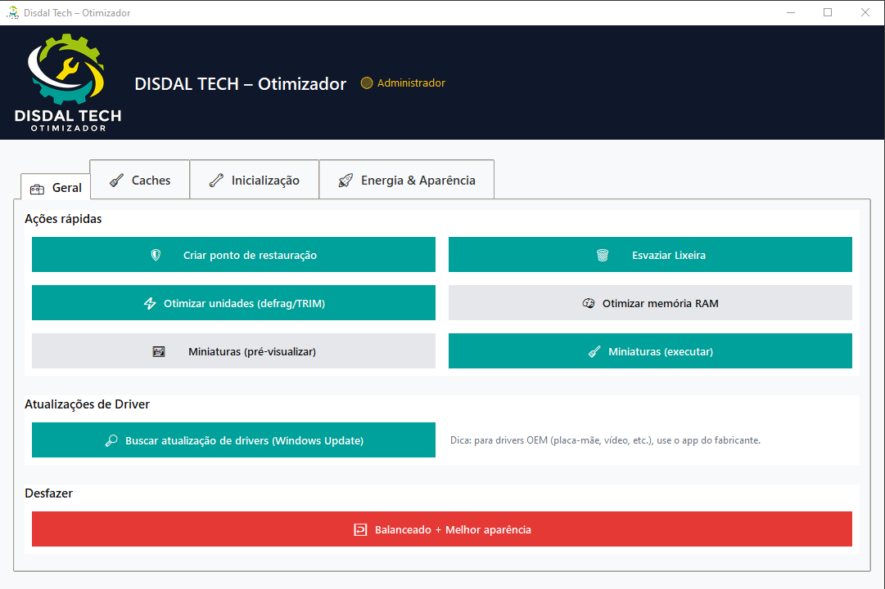

# 🛠️ Disdal Tech – Otimizador para Windows 10/11

Aplicativo gráfico (GUI) para otimizações seguras e reversíveis no Windows. Foco em simplicidade para o usuário final e em operações que **não comprometem o sistema**.



---

## ✅ Compatibilidade & Distribuição

- Compatível com **Windows 10 e 11 (64-bit)**
- Recomendado executar como **Administrador (UAC)** para acesso completo

---

## ✨ Funcionalidades

### 🔧 Geral
- Criar **ponto de restauração** antes de alterações
- **Esvaziar Lixeira** silenciosamente
- **Otimizar unidades** (defrag/TRIM) com aviso de conclusão
- **Limpar cache de miniaturas** (`thumbcache*.db`)
- **Otimizar memória RAM** (esvazia working set de processos não-críticos)

### 🌐 Limpeza de Caches de Navegadores

Suporte a:

- Google Chrome
- Microsoft Edge (Chromium)
- Opera / Opera GX
- Mozilla Firefox

Remove:

- Cache, GPUCache, Code Cache (JS/WASM), Service Worker Cache
- Firefox: `cache2`, `startupCache`, etc.

**Não remove** histórico, senhas, favoritos ou cookies de login.

> 💡 Dica: feche os navegadores antes de limpar para maior eficácia.

### 🚀 Inicialização

- Listar, habilitar ou desabilitar apps de inicialização (Run)
- Suporte a chaves HKCU e HKLM (requer UAC para HKLM)

### ⚡ Energia & Aparência

- Alternar entre:
  - Plano de energia: **Alto desempenho ↔ Balanceado**
  - Aparência: **Melhor desempenho ↔ Melhor aparência**
- Botão de **Desfazer rápido**: retorna para Balanceado + Melhor aparência

### 🔄 Atualização de Drivers

- Executa:
  - `UsoClient StartScan / StartInteractiveScan`
  - `pnputil /scan-devices`
- Abre Configurações → Windows Update
- Para drivers OEM (GPU, chipset, rede), recomenda-se usar ferramentas do fabricante:
  - GeForce Experience, AMD Adrenalin, Intel DSA, etc.

---

## ▶️ Como Usar

1. **Baixe o executável** na seção *Releases* do GitHub
2. Salve em uma pasta local (ex.: Downloads ou Área de Trabalho)
3. Clique com o botão direito → **Executar como administrador**
4. Interface dividida em:
   - **Geral**: ações rápidas
   - **Caches**: limpeza de navegadores
   - **Inicialização**: gerenciar apps de startup
   - **Energia & Aparência**: ajustes visuais e de desempenho
   - **Desfazer**: restaura configurações padrão

---

## ⚙️ Segurança & Permissões

- Recomendado executar como **Administrador (UAC)** para:
  - Otimização de disco
  - Ajustes no Registro
  - Inicialização em HKLM
  - Otimização de RAM mais eficaz
- **Não realiza alterações irreversíveis**
- Logs locais gerados apenas para diagnóstico: `%TEMP%\win_optimizer_logs`

---


## 🛠️ Para Desenvolvedores

### Ambiente de build

```bash
python -m venv .venv
.\.venv\Scripts\Activate.ps1
pip install --upgrade pip
pip install pyinstaller psutil send2trash pillow
